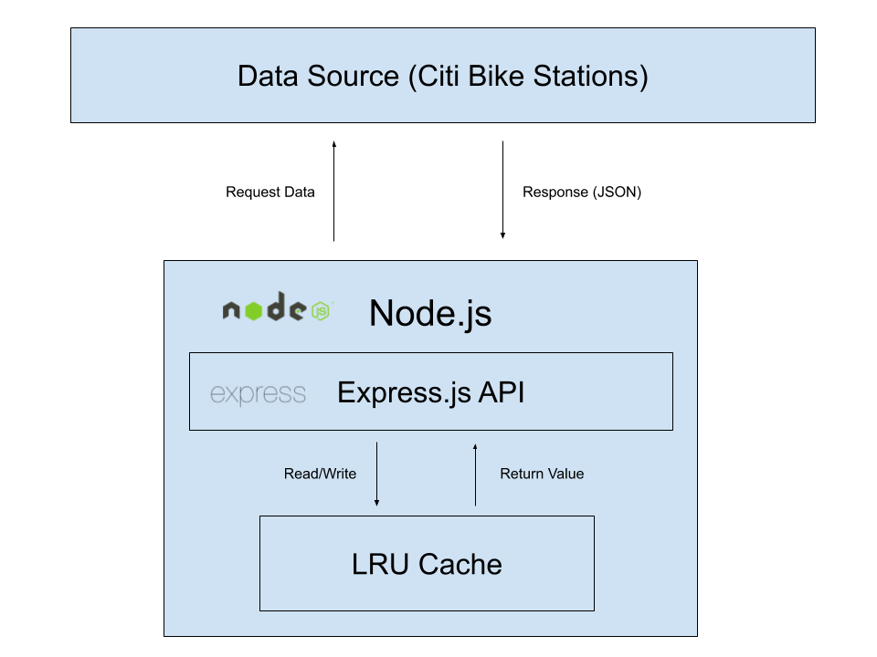

# NBC News - Take-Home Coding Assessment

## Basic Structure


## Quick Start

### Software Installation

**Homebrew:** [[Install](https://docs.brew.sh/Installation.html)]

**JSON Formatter (Chrome Extension):** [[Install](https://chrome.google.com/webstore/detail/json-formatter/bcjindcccaagfpapjjmafapmmgkkhgoa?hl=en)]

**Data Source** [[Citi Bike Stations]](https://feeds.citibikenyc.com/stations/stations.json)

**Node v8:**

1. `brew install node@8`
1. `node --version` check (e.g. `v8.11.1`)

**NPM 5.6:**

1. `npm install -g npm@^5.6.0`
1. `npm --version` check (e.g. `5.6.0`)

### Install Dependencies

**NPM**
```
npm install
```

### Start Server
```
npm run start
```
* Listening on port 4000

### Run Tests
```
npm test
```

## Endpoints

### Stations
* **Returns**: all stations
* **Query Parameter(s)**:
    * `page` (*@type number*)
* **Example**: `/stations/?page=1`
```
GET /stations
```

* **Returns**: all "In Service" stations
* **Query Parameter(s)**:
    * `page` (*@type number*)
* **Example**: `/stations/in-service?page=1`
```
GET /stations/in-service
```

* **Returns**: all "Not In Service" stations
* **Query Parameter(s)**:
    * `page` (*@type number*)
* **Example**: `/stations/not-in-service?page=1`
```
GET /stations/not-in-service
```

* **Returns**: all stations with `searchstring` in "Station Name" or "Street Address"
* **URL Parameter(s)**: 
    * `searchstring` (*@type string*)
* **Example**: `/stations/wth`
```
GET /stations/:searchstring
```

### Dockable
* **Returns**: boolean `dockable` with message
* **URL Parameter(s)**:
    * `stationid` (*@type number*)
    * `bikestoreturn` (*@type number*) 
* **Example**: `/dockable/1234/23`
```
GET /dockable/:stationid/:bikestoreturn
```

## Things That Can Be Improved
* Authentication on requests coming
* Improve testing with more diverse mock data
* Integration tests

## Overall Comment(s)
* Great exercise. I enjoyed working on this take home assessment a lot.
 
